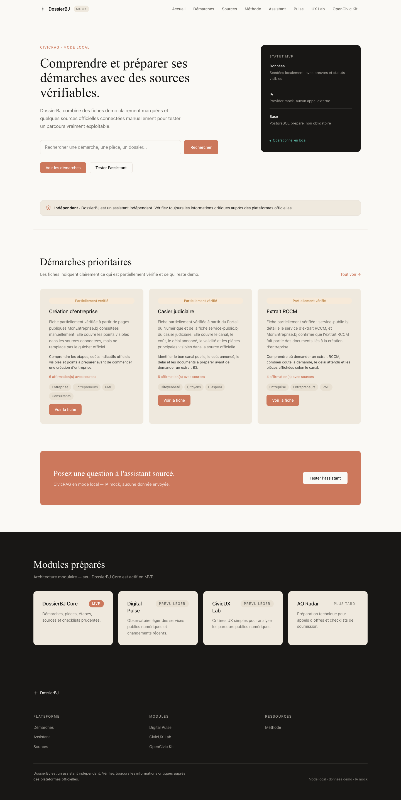
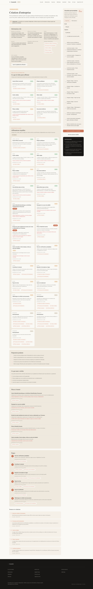
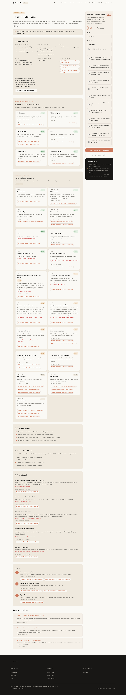
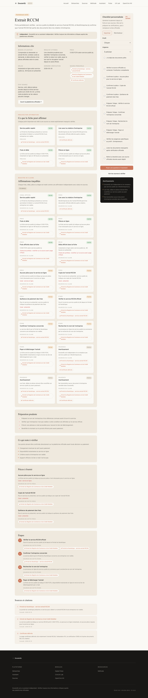
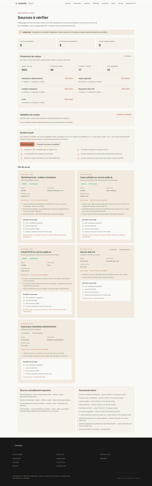

# DossierBJ Platform

DossierBJ Platform est une base de plateforme documentaire civique et économique. Le MVP, **DossierBJ Core**, aide à comprendre, préparer et suivre des démarches à partir de sources vérifiables. Le moteur documentaire prévu s'appelle **CivicRAG**.

> DossierBJ est un assistant indépendant. Il ne remplace pas les plateformes officielles. Les données actuelles sont des données de démonstration non officielles.

## Statut

Beta Core DossierBJ en mode frugal : monorepo pnpm, app web Next.js, recherche locale de démarches, fiches partiellement sourcées, checklist personnalisée sauvegardée dans le navigateur, assistant CivicRAG mock/keyword, page sources à vérifier, revue éditoriale locale des claims, proposition locale de sources candidates et tests sans API externe.

Audit critique initial effectué : le dépôt démarre en mode mock sans API payante, les seeds demo utilisent des URLs réservées non officielles, `AI_PROVIDER=mock` est résolu explicitement, et `DATA_MODE=mock` est testé sans `DATABASE_URL`.

Sprint Core concret ajouté : la création d'entreprise, le casier judiciaire et l'extrait RCCM disposent maintenant de sources connectées, de statuts `partially_verified`, et d'une matrice "affirmation -> source". Le casier judiciaire et l'extrait RCCM incluent les coûts, délais et pièces visibles sur `service-public.bj` au 2026-05-30. Les autres fiches restent explicitement demo non officielles.

PostgreSQL est optionnel mais fonctionnel : `DATA_MODE=mock` reste le défaut, tandis que `DATA_MODE=postgres` lit les procédures, sources, claims, chunks RAG et requêtes assistant depuis la base après migration et seed.

Le dépôt est prêt pour contribution publique : licence MIT, guide de contribution, code de conduite, politique sécurité, templates GitHub, Dependabot et workflow CI mock/PostgreSQL.

## Stack

- TypeScript strict
- Next.js App Router
- React
- Tailwind CSS
- pnpm workspace
- Zod
- Drizzle ORM avec PostgreSQL optionnel
- Vitest
- ESLint et Prettier

## Installation

```bash
pnpm install
cp .env.example .env.local
pnpm dev
```

Ouvrir ensuite [http://localhost:3000](http://localhost:3000).

## Commandes

```bash
pnpm dev
pnpm build
pnpm lint
pnpm typecheck
pnpm test
pnpm validate:sources
pnpm test:postgres
pnpm test:e2e
pnpm test:e2e:postgres
pnpm db:reset:dev
pnpm db:seed
```

`pnpm test:postgres`, `pnpm test:e2e:postgres` et `pnpm db:reset:dev` supposent une base de développement jetable dans `DATABASE_URL`.

## Vérification Locale

Dernière vérification complète effectuée le 2026-05-30 en mode mock et PostgreSQL local :

```bash
pnpm format
pnpm test
pnpm typecheck
pnpm lint
pnpm validate:sources
pnpm build
pnpm test:e2e
pnpm test:postgres
pnpm test:e2e:postgres
```

Résultats observés :

- Tests unitaires/domaines : 50 tests passés, 2 tests ignorés volontairement.
- Tests PostgreSQL : 2 tests d'intégration passés sur la base locale `bj`.
- Smoke e2e mock et PostgreSQL : `/api/health`, `/demarches`, `/demarches/creation-entreprise`, `/sources`, `/sources/claims`, `/sources/nouvelle`, `/sources/source-review-business-creation` et `/api/assistant` répondent en `200`.
- Build Next.js production : réussi avec les routes statiques et dynamiques attendues.
- Validation sources : 0 erreur, 0 avertissement.
- Captures Playwright prises depuis le serveur production local en mode PostgreSQL, avec contrôle responsive mobile sur la fiche casier judiciaire.

Captures prises en mode PostgreSQL local :











## Architecture

```text
apps/web        Application Next.js mobile-first
packages/core   Schémas domaine, recherche, checklists, sources demo, helpers
packages/rag    CivicRAG mocké, retrievers, policies, providers
packages/db     Schéma Drizzle, migrations, seed et repositories mock/postgres
packages/ui     Future couche OpenCivic Kit, non branchée dans l'app MVP
docs            Vision, architecture, politiques et roadmap
```

## Surfaces MVP

- `/demarches` : recherche keyword locale, filtres par catégorie, profil et statut.
- `/demarches/[slug]` : fiche démarche avec besoin utilisateur, faits sourcés, registre de claims, points à vérifier, sources par pièce/étape, avertissements et checklist interactive.
- `/assistant` : assistant mock/keyword avec citations, confiance et informations manquantes.
- `/sources` : mini back-office fichier-based pour les sources connectées, la validation et la couverture des claims.
- `/sources/[id]` : détail de revue source avec checklist, historique, démarches liées et claims associés.
- `/sources/claims` : cockpit éditorial local pour prioriser les claims à revoir et noter les actions dans le navigateur.
- `/sources/nouvelle` : formulaire local `localStorage` pour préparer une source candidate sans auth, scraping ou DB obligatoire.
- `/methode-verification` : méthode de revue humaine, citations et niveaux de confiance.
- `/api/health` : indique le mode actif et l'état DB.
- `/api/assistant` : endpoint local sans provider IA payant.

## Mode Mock

Le mode par défaut ne dépend d'aucune API payante :

```env
DATA_MODE="mock"
AI_PROVIDER="mock"
ENABLE_VECTOR_SEARCH="false"
PAYMENTS_ENABLED="false"
ENABLE_AUTH="false"
```

Les pages et l'API `/api/assistant` utilisent des données seedées marquées comme non officielles.

`AI_PROVIDER=mock` est le seul provider activé dans le MVP. Un provider réel comme OpenAI doit être ajouté via un adapter explicite avant utilisation ; il ne sera pas appelé silencieusement.

`DATA_MODE=mock` ne crée aucun client base de données et ne demande pas `DATABASE_URL`.

## Mode Postgres Optionnel

Pour tester la persistance réelle :

```env
DATA_MODE="postgres"
DATABASE_URL="postgresql://..."
AI_PROVIDER="mock"
```

Commandes utiles :

```bash
pnpm db:generate
pnpm db:migrate
pnpm db:seed
pnpm db:reset:dev
pnpm test:postgres
pnpm test:e2e:postgres
```

Le seed est idempotent et alimente les sources, documents, procédures, pièces, étapes, claims, références, chunks RAG et événements de revue. Les tests Postgres sont séparés du test standard pour préserver un démarrage sans base.

## Gestion Locale Des Sources

Le MVP ne scrape pas. Les sources sont ajoutées par revue humaine et gérées dans :

```text
packages/core/src/seed/sourceRegistry.ts
```

La page `/sources` affiche cette file de revue, les sources exposées, les documents, la couverture des claims, l'état de validation et le workflow d'ingestion manuelle. Une source ne doit devenir vérifiée qu'après revue contrôlée, rattachement aux `SourceReference`, et tests mis à jour.

La page `/sources/claims` crée une file de travail éditoriale : priorité critique/haute/moyenne/basse, filtres par fiche/type/statut, notes locales et export JSON. Elle ne modifie pas le corpus ; elle prépare la revue humaine avant édition des seeds ou d'un futur back-office.

La page `/sources/nouvelle` génère un brouillon local en JSON à partir d'un formulaire. Ce brouillon reste dans le navigateur et doit être recopié manuellement dans le registre après revue contrôlée ; il ne rend aucune information officielle.

Sources connectées :

- MonEntreprise.bj pour création d'entreprise, coûts/délais, pièces et certificats.
- Portail du Numérique pour le service casier judiciaire et l'extrait RCCM.
- Service-public.bj pour les fiches casier judiciaire et extrait RCCM, avec extraction prudente du coût, délai, public cible, pièces et étapes principales le 2026-05-30.

## Variables D'environnement

Voir `.env.example`. Les clés réelles ne doivent jamais être committées. PostgreSQL, provider IA, paiements et auth sont prévus mais désactivés par défaut.

## Roadmap Courte

1. Extraire les pièces par forme juridique pour la création d'entreprise.
2. Ajouter une surveillance légère des changements service-public.bj pour détecter les coûts/délais qui évoluent.
3. Ajouter une persistance éditoriale optionnelle pour les notes de claims et brouillons sources.
4. Ajouter de vrais tests navigateur quand le budget de dépendances Playwright est accepté.
5. Enrichir CivicRAG avec un retrieval local indexé avant toute vector DB externe.

## Limites Connues

- Certaines fiches restent des placeholders demo, pas des informations administratives.
- Les sources officielles connectées sont encore un corpus manuel minimal, pas une ingestion complète.
- Les informations partiellement vérifiées doivent être revérifiées sur les plateformes officielles avant toute décision.
- Pas d'authentification, paiement, OCR, embeddings ou base distante obligatoire.
- Le mini back-office reste fichier-based ; les formulaires créent seulement des brouillons et notes locales.
- Les claims sont explicites, persistés, résumés par couverture et revus dans un cockpit local, mais pas encore modifiés dans une interface persistante.
- OpenCivic Kit existe comme package préparatoire, mais n'est pas encore publié ni consommé par l'app.
- AO Radar est limité au modèle `Opportunity` et à la documentation.

## Stratégie Open Source

OpenCivic Kit pourra exposer des composants UI, types TypeScript publics, helpers de citation/checklist et documentation. Le corpus enrichi, les prompts critiques, workflows premium, scoring et analytics business restent propriétaires.

## Contribution

- Lire `CONTRIBUTING.md` avant d'ouvrir une pull request.
- Utiliser les templates GitHub pour bugs, sources et demandes de fonctionnalité.
- Lancer `pnpm format`, `pnpm lint`, `pnpm typecheck`, `pnpm test`, `pnpm validate:sources`, `pnpm build` et `pnpm test:e2e` avant publication.
- Pour les changements de données PostgreSQL : lancer aussi `pnpm db:reset:dev`, `pnpm test:postgres` et `pnpm test:e2e:postgres`.
- Ne jamais ajouter de donnée personnelle, secret ou affirmation administrative non citée.

## Partage Public

Pitch court : DossierBJ est un MVP civictech open source pour préparer des démarches au Bénin avec sources, citations, checklists et assistant CivicRAG mock, sans API payante obligatoire.

Lien GitHub : `https://github.com/chabelbossa/bj`

## Documents À Lire

- `docs/PROJECT_BRIEF.md`
- `docs/ARCHITECTURE.md`
- `docs/ROADMAP.md`
- `docs/RAG_POLICY.md`
- `docs/DEV_SETUP.md`
